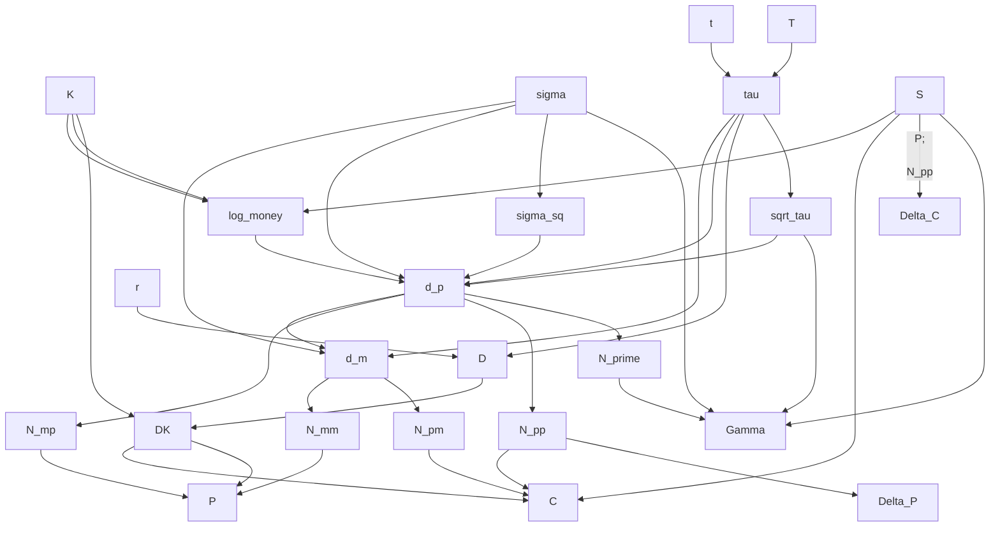

<!-- PROJECT SHIELDS -->
<!--
*** I'm using markdown "reference style" links for readability.
*** Reference links are enclosed in brackets [ ] instead of parentheses ( ).
*** See the bottom of this document for the declaration of the reference variables
*** for contributors-url, forks-url, etc. This is an optional, concise syntax you may use.
*** https://www.markdownguide.org/basic-syntax/#reference-style-links
-->
[![Contributors][contributors-shield]][contributors-url]
[![Forks][forks-shield]][forks-url]
[![Stargazers][stars-shield]][stars-url]
[![Issues][issues-shield]][issues-url]
[![MIT License][license-shield]][license-url]
[![LinkedIn][linkedin-shield]][linkedin-url]

<!-- PROJECT LOGO -->
<br />
<div align="center">
  <a href="https://github.com/bwrob/options-dataframes">
    
  </a>

<h3 align="center">options-dataframes</h3>

  <p align="center">
    High-performance Black-Scholes calculations for dataframes.
    <br />
    <a href="https://github.com/bwrob/options-dataframes"><strong>Explore the docs »</strong></a>
    <br />
    <br />
    <a href="https://github.com/bwrob/options-dataframes">View Demo</a>
    ·
    <a href="https://github.com/bwrob/options-dataframes/issues/new?labels=bug&template=bug-report---.md">Report Bug</a>
    ·
    <a href="https://github.com/bwrob/options-dataframes/issues/new?labels=enhancement&template=feature-request---.md">Request Feature</a>
  </p>
</div>

<!-- TABLE OF CONTENTS -->
<details>
  <summary>Table of Contents</summary>
  <ol>
    <li><a href="#about-the-project">About The Project</a></li>
    <li><a href="#usage">Usage</a></li>
    <li><a href="#getting-started">Getting Started</a></li>
    <li><a href="#examples">Detailed Features Overview</a></li>
    <li><a href="#roadmap">Roadmap</a></li>
    <li><a href="#contributing">Contributing</a></li>
    <li><a href="#license">License</a></li>
    <li><a href="#contact">Contact</a></li>
    <li><a href="#acknowledgments">Acknowledgments</a></li>
  </ol>
</details>

<!-- ABOUT THE PROJECT -->
## About The Project

![Project Screenshot Placeholder][product-screenshot]

Options-dataframes is a high-performance Python package designed for efficient Black-Scholes calculations on large option datasets. Leveraging the power of Polars, a high-performance data processing library, this package provides a fast and scalable solution for quantitative analysts and financial engineers.

### Key Features

- **Efficient Black-Scholes Calculations**: Calculate option prices, implied volatilities, and greeks (delta, gamma, vega, theta, rho) with optimized algorithms.

- **Pandas and Polars Compatibility**: Seamlessly integrate with both Pandas and Polars dataframes, offering flexibility in data handling.

- **Dependency Tree Optimization**: Avoid redundant calculations by intelligently managing dependencies, ensuring maximum performance.

- **Robust Root-Finding Algorithms**: Employ Brent and Jaeckel's algorithms for accurate and efficient implied volatility calculations.

### Target Audience

- Quantitative analysts
- Financial engineers
- Researchers
- Traders

### Why Choose options-dataframes?

- Speed: Experience significantly faster Black-Scholes calculations compared to traditional Python implementations.
- Scalability: Handle large datasets without performance degradation.
- Ease of Use: A straightforward API that integrates seamlessly into your existing workflows.
- Accuracy: Rely on robust algorithms for accurate results.
- Performance Optimization: Benefit from intelligent dependency management and optimized calculations.

<p align="right">(<a href="#readme-top">back to top</a>)</p>

<!-- USAGE EXAMPLES -->
## Usage

Here is an example of how to use the package on the included test dataframe.

```python
import options_dataframes as odf

# Loads included test dataframe, including prices
test_option_data = odf.test_option_data(length=10_000)

# Calculates option implied volatilities
test_option_data = odf.with_black_scholes(test_option_data, method="brent")

# Calculates requested option greeks
test_option_data = odf.with_black_scholes_greeks(
    test_option_data,
    greeks=[odf.Greeks.Delta, odf.Greeks.Theta],
)

odf.show(test_option_data, max_rows=5, random=True)
```

*For more examples, please refer to the [Documentation](https://example.com)*

<p align="right">(<a href="#readme-top">back to top</a>)</p>

<!-- GETTING STARTED -->
## Getting Started

The package is available in PyPI. To get started, follow the instructions below:

1. Install the package in a virtual environment

   ```bash
   source my_env/bin/activate
   pip install options-dataframes
   ```

   or using poetry

   ```bash
   poetry install options-dataframes
   ```

2. Import and use the package

    ```python
    import options_dataframes as odf
    ```

<p align="right">(<a href="#readme-top">back to top</a>)</p>

## Detailed Features Overview

### Black-Scholes Inputs

In the below by **BS inputs** we mean the following columns:

- `strike`
- `expiration`
- `option_type`
- `risk_free_rate`
- `underlying_price`

and either `underlying_price` or `implied_volatility`. The inputs will be denoted in mathematical formulas as:

- $S$ - `underlying_price`
- $T$ - `expiration`
- $r$ - `risk_free_rate`
- $K$ - `strike`
- $t$ - `time_to_expiration`
- $\sigma$ - `implied_volatility`
- $P$ - `option_price`

### Black-Scholes Calculations

- `odf.with_black_scholes`
  - Validates input dataframe contains necessary BS inputs.
  - Calculates option prices from BS inputs or implied volatilities, if price is given.
  - Appends respective columns `option_price` or `implied_volatility` to the original dataframe.

- `odf.with_black_scholes_greeks`
  - Validates input dataframe contains necessary BS inputs, if `implied_volatility` is not present calculates it.
  - Calculates greeks with optimized algorithms.
  - Avalible greeks:
    - First-order:
      - Delta - $\frac{\partial P}{\partial S}$
      - Rho - $\frac{\partial P}{\partial r}$
      - Vega - $\frac{\partial P}{\partial \sigma}$
      - Theta - $\frac{\partial P}{\partial t}$
      - Dual Delta - $\frac{\partial P}{\partial K}$
    - Second-order:
      - Gamma - $\frac{\partial^2 P}{\partial S^2}$
      - Vanna - $\frac{\partial^2 P}{\partial \sigma \partial S}$
      - Vomma - $\frac{\partial^2 P}{\partial \sigma^2}$
  - Appends respective columns `delta`, `gamma`, `vega`, `theta`, `rho` to the original dataframe.

### Pandas and Polars Compatibility

Seamlessly integrate with both Pandas and Polars dataframes, offering flexibility in data handling.

All calculations are performed natively in Rust using Polars and are highly optimized for performance.
The Python package provides a [dataframe wrapper](https://github.com/bwrob/options-dataframes/tree/main/src/dataframe) for both Pandas and Polars dataframes.

All functions with dataframe inputs are agnostic to the dataframe type, and can be used with both.

### Dependency Tree Optimization

To avoid redundant calculations by intelligently managing dependencies, ensuring maximum performance. Partial calculations that would be used ex. for both delta and theta are only performed once.

Example dependency tree for call and put options price, delta and gamma:



For more information, please refer to the [documentation](https://github.com/bwrob/options-dataframes/blob/main/src/dataframe/README.md).

### Robust Root-Finding Algorithms

Employ Rust-implemented algorithms for accurate and efficient implied volatility calculation. Algorithms include:

#### Brent's method

General purpose bracketed algorithm for finding the root of a continous function.

- [Rust native implementation](https://argmin-rs.github.io/argmin/argmin/solver/brent/index.html)

#### Jaeckel's rational algorithm

Algorithm specifically optimized for Black-Scholes implied volatility calculations.

- [The original paper](http://www.jaeckel.org/LetsBeRational.pdf)
- [Pure Python implementation](https://github.com/vollib/py_lets_be_rational)
- [Rust implementation](https://github.com/nakashima-hikaru/implied-vol)

<!-- ROADMAP -->
## Roadmap

- [x] Create Development README.
- [ ] Dummy Rust-Python interop package.
- [ ] Calculation of BS price (no dependency tree).
- [ ] Test data included in package.
- [ ] Set up CI pipeline.
- [ ] Calculation of IV.
  - [ ] Brent's method (use Rust implementation).
  - [ ] Jaeckel's rational algorithm (use implied-vol Rust crate).
  - [ ] Performance comparison.
- [ ] Implementation of dependency tree for BS and IV.
- [ ] Calculation of greeks.
  - [ ] Delta.
  - [ ] Gamma.
  - [ ] Vega.
  - [ ] Theta.
  - [ ] Rho.
  - [ ] Dual Delta.
  - [ ] Vanna.
  - [ ] Vomma.
- [ ] Release to PyPI.
- [ ] Internal IV implementation.

See the [open issues](https://github.com/bwrob/options-dataframes/issues) for a full list of proposed features (and known issues).

<p align="right">(<a href="#readme-top">back to top</a>)</p>

<!-- CONTRIBUTING -->
## Contributing

Contributions are what make the open source community such an amazing place to learn, inspire, and create. Any contributions you make are **greatly appreciated**.

If you have a suggestion that would make this better, please fork the repo and create a pull request. You can also simply open an issue with the tag "enhancement".
Don't forget to give the project a star! Thanks again!

1. Fork the Project
2. Create your Feature Branch (`git checkout -b feature/AmazingFeature`)
3. Commit your Changes (`git commit -m 'Add some AmazingFeature'`)
4. Push to the Branch (`git push origin feature/AmazingFeature`)
5. Open a Pull Request

<p align="right">(<a href="#readme-top">back to top</a>)</p>

### Top contributors

<a href="https://github.com/bwrob/options-dataframes/graphs/contributors">
  
</a>

<!-- LICENSE -->
## License

Distributed under the MIT License. See `LICENSE.txt` for more information.

<p align="right">(<a href="#readme-top">back to top</a>)</p>

<!-- CONTACT -->
## Contact

Your Name - <email@email_client.com>

Project Link: [https://github.com/bwrob/options-dataframes](https://github.com/bwrob/options-dataframes)

<p align="right">(<a href="#readme-top">back to top</a>)</p>

<!-- ACKNOWLEDGMENTS -->
## Acknowledgments

- [Best-README-Template](https://github.com/othneildrew/Best-README-Template)
- [Peter Jaeckel](http://www.jaeckel.org/)
- [Polars](https://pola-rs.github.io/polars/)

<p align="right">(<a href="#readme-top">back to top</a>)</p>

<!-- MARKDOWN LINKS & IMAGES -->
<!-- https://www.markdownguide.org/basic-syntax/#reference-style-links -->
[contributors-shield]: https://img.shields.io/github/contributors/bwrob/options-dataframes.svg?style=for-the-badge
[contributors-url]: https://github.com/bwrob/options-dataframes/graphs/contributors
[forks-shield]: https://img.shields.io/github/forks/bwrob/options-dataframes.svg?style=for-the-badge
[forks-url]: https://github.com/bwrob/options-dataframes/network/members
[stars-shield]: https://img.shields.io/github/stars/bwrob/options-dataframes.svg?style=for-the-badge
[stars-url]: https://github.com/bwrob/options-dataframes/stargazers
[issues-shield]: https://img.shields.io/github/issues/bwrob/options-dataframes.svg?style=for-the-badge
[issues-url]: https://github.com/bwrob/options-dataframes/issues
[license-shield]: https://img.shields.io/github/license/bwrob/options-dataframes.svg?style=for-the-badge
[license-url]: https://github.com/bwrob/options-dataframes/blob/master/LICENSE.txt
[linkedin-shield]: https://img.shields.io/badge/-LinkedIn-black.svg?style=for-the-badge&logo=linkedin&colorB=555
[linkedin-url]: https://linkedin.com/in/bartoszmwroblewski
[product-screenshot]: images/screenshot.png
